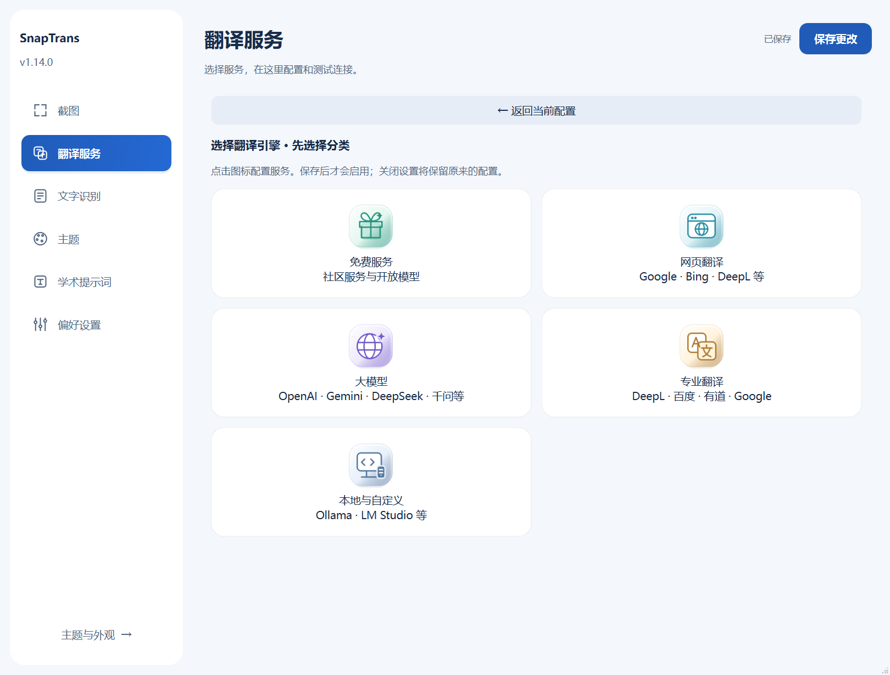

# SnapTrans

**截图、标注、识别、翻译，一处完成。**  
A Windows capture workspace with local OCR, translation and editable pinned images.

[下载安装包与便携版](https://github.com/Maverickquliushang/SnapTrans/releases/latest) · [使用说明](docs/usage-1.14.0.md) · [构建与发布](docs/github-release.md)



## 下载与启动

当前版本 **1.14.0**，Windows 10 / 11 x64。

- **安装版**：运行 `SnapTrans-1.14.0-Setup-x64.exe`，选择可写的安装目录。
- **便携版**：完整解压 `SnapTrans-1.14.0-win-x64.zip`，运行 `SnapTrans/SnapTrans.exe`，保留旁边的 `_internal` 文件夹。
- 首次打开进入设置。默认晴空蓝主题、本地 OCR、MyMemory 翻译，界面语言跟随系统。
- 设置、密钥、缓存、日志和运行临时文件保存在程序旁的 `data`。默认安装不创建注册项或系统快捷方式；系统集成可自行选择。Windows 自身记录、安装器临时文件不属于应用数据。
- 升级前退出托盘中的旧版；安装版选择原安装目录。便携版解压到新目录后，可复制旧版 `data`。跨 Windows 用户或电脑时，已加密密钥需重新填写。

发布文件尚未做代码签名。Release 附 SHA-256 校验文件，用于核对完整性。

## 主要功能

- **统一截图工作区**：默认 F2 截图并翻译，Alt+W 仅截图。按习惯录制快捷键，松键即保存；可关闭自动翻译。
- **原位翻译与阅读弹窗**：随时切换服务、源语言与目标语言，编辑识别文字后重新翻译。
- **可编辑贴图**：移动、缩放、裁剪、标注，在贴图内翻译和对照原图；返回工作区会关闭对应贴图。
- **标注工具**：方框、圆形、箭头、画笔、文字、橡皮擦和涂抹马赛克，支持尺寸、颜色、撤销与重做。
- **多种服务**：网页翻译、MyMemory、DeepL、百度、有道、Google Cloud、Microsoft，以及 NVIDIA、OpenAI、Gemini、Claude、DeepSeek、千问等大模型服务；各服务单独保留配置。
- **本地模型**：Ollama、LM Studio、llama.cpp、vLLM 和兼容接口，需自行启动模型服务。
- **本地与云端 OCR**：默认本地 RapidOCR；也可选择支持图片输入的视觉模型。附带本地 OCR 模型主要面向中文和英文。
- **10 种界面语言**：简体中文、繁體中文、English、日本語、한국어、Français、Deutsch、Español、Português、Русский。**选中即切换并自动保存**，不改变翻译方向或其他未保存的设置。
- **七套主题与阅读偏好**：默认晴空蓝，支持字号、置顶、启动设置，以及单独确认修改和保存的学术提示词。

## 服务与隐私

在线翻译会把识别文字发送给所选服务；只有启用云端 OCR 时才发送选区图片。程序不会自动上传整张桌面或自动换用其他服务。网页服务受网络、登录、验证码、额度与网页变化影响，遇到验证时可打开原网页处理。实际支持的语言与额度由服务决定。

**OCR 使用保留的原始选区。贴图上的裁剪、标注和马赛克不会更改 OCR 输入。** 分享图片前请核对导出结果。

发布包不包含个人配置或 API Key。可选择用当前 Windows 用户加密保存密钥；不要公开自己的 `data` 文件夹。详见 [安全与隐私](SECURITY.md)。

## 从源码运行

Windows 10 / 11 x64，Python 3.12 x64。每个 PowerShell 进程先运行环境脚本，项目缓存与临时产物留在项目中。

```powershell
. ./project-env.ps1
./scripts/bootstrap.ps1
./.venv/Scripts/python.exe main.py
./.venv/Scripts/python.exe -m pytest -q
```

## 构建

```powershell
. ./project-env.ps1
./scripts/build.ps1
./.venv/Scripts/python.exe scripts/build_installer.py
./.venv/Scripts/python.exe scripts/export_source.py
```

产物在 `output`。GitHub Actions 支持手动构建和版本标签触发；不会自动发布 Release。桌面交互自检需要交互式 Windows 会话。详见 [发布说明](docs/github-release.md) 和 [验证范围](docs/release-validation.md)。

## English

Download the installer or portable ZIP from [Releases](https://github.com/Maverickquliushang/SnapTrans/releases/latest). Extract the entire ZIP before launching `SnapTrans.exe`. First launch opens Settings. The interface follows your system language; selecting a language in Preferences applies and saves it immediately.

Capture with F2, annotate or translate in place, and pin images for editing and side-by-side reference. Translation languages are independent of the interface language. Local OCR works offline; online services require their own network access, configuration and quotas. App data stays in the `data` folder beside the executable. Cloud OCR receives the original captured region, including content hidden later by annotations.

## 贡献与许可

欢迎通过 Issues 反馈复现步骤、界面翻译和服务适配问题。提交截图或日志前请移除密钥和个人内容。参见 [贡献指南](CONTRIBUTING.md)。

应用代码与原创分类图标使用 [MIT](LICENSE)。第三方依赖、OCR 模型和厂商品牌标识保留各自许可，见 [第三方声明](THIRD_PARTY_NOTICES.md)。本项目与所列服务商无隶属关系。
